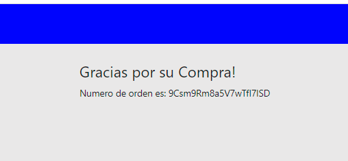

# DOCUMENTACION

## Descarga del proyecto 

1. Clonar repositorio con 
> git clone https://github.com/cmelli22/TiendaMusicalMellibosky.git
2. Ejecutar script en un cmd
> cd app
3. instalar paquetes npm y depenedencias
> npm install
4. Correr
> npm start

## Dependencias

* react
* react-dom
* Firebase
* react-router-dom
* mui/material

## Componentes principales

### Firebase.js
Administra credenciales y configuracion para la conexion con firabase

### CartContext.js

Administra la configuracion del context y retorne un componente CustomProvider

### Cart.js

Encargado de renderizar el carrito

# NAVEGACION POR EL SITIO 

1. HOME

2. CATEGORIA INSTRUMENTOS

3. VER DETALLE

4. AGREGAR AL CARRITO 

5. IR AL CARRITO O TERMINAR MI COMPRA

6. FORMULARIO

7. COMPRA REALIZADA

